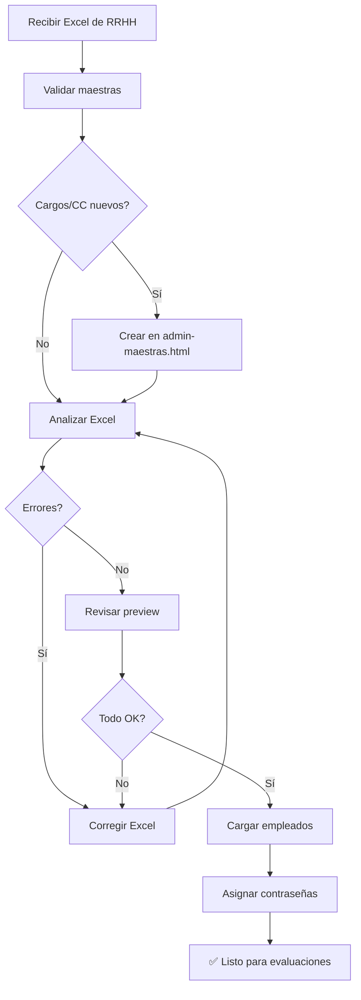

# Guía de Carga Masiva de Empleados desde Excel

## Cuándo usar esta funcionalidad

✅ **Usar cuando:**
- Inicio de nuevo período de evaluación con empleados nuevos
- Sincronización masiva con datos de RRHH
- Actualización de 10+ empleados al mismo tiempo
- Migración desde otro sistema

❌ **No usar para:**
- Crear/editar 1-5 empleados → Usar interfaz web [empleados.html](../empleados.html)
- Cambios puntuales → Usar panel de administración

---

## Proceso de carga (3 pasos)

### 1️⃣ Preparar Excel con estructura correcta

### 2️⃣ Analizar archivo (validación previa)

### 3️⃣ Aplicar cambios (carga a BD)

---

## Estructura del archivo Excel

### Columnas OBLIGATORIAS (4)

| Columna | Variantes aceptadas | Ejemplo |
|---------|---------------------|---------|
| **Cédula** | `CEDULA`, `IDENTIFICACION`, `CC`, `DOCUMENTO` | `1020345678` |
| **Nombres** | `NOMBRES_COMPLETOS`, `NOMBRES`, `NOMBRE_COMPLETO`, `NOMBRE` | `Juan Pérez Gómez` |
| **Cargo** | `CARGO`, `PUESTO` | `DIRECTOR COMERCIAL` |
| **Centro de Costo** | `CENTRO_DE_COSTO`, `CENTRO_COSTO`, `ÁREA`, `AREA` | `VENTAS` |

### Columnas OPCIONALES (recomendadas)

| Columna | Variantes aceptadas | Ejemplo |
|---------|---------------------|---------|
| Correo Personal | `CORREO_PERSONAL`, `EMAIL_PERSONAL`, `CORREO` | `juanperez@gmail.com` |
| Correo Corporativo | `CORREO_CORPORATIVO`, `EMAIL_CORPORATIVO`, `EMAIL` | `juanperez@empresa.com` |
| Celular | `CELULAR`, `TELEFONO`, `MOVIL` | `3001234567` |
| Empresa | `EMPRESA`, `RAZON_SOCIAL`, `NIT` | `BLUEDOORS 100 LUXURY SUITES` o `901135347-9` |
| Jefe | `JEFE`, `CEDULA_JEFE`, `SUPERVISOR` | Cédula del jefe: `1015234567` |
| Fecha Ingreso | `FECHA_INGRESO`, `FECHA_INICIO` | `2024-01-15` |
| Aplica KPI | `APLICA_KPI`, `KPI` | `SI` o `NO` |

### ⚠️ Validaciones importantes

1. **Cédulas únicas** - No puede haber dos empleados con la misma cédula
2. **Cargo debe existir** - Si no existe en BD, se debe crear primero en [admin-maestras.html](../admin-maestras.html)
3. **Centro de costo debe existir** - Igual que cargo
4. **Jefe debe estar en BD** - Usar cédula del jefe, debe estar previamente cargado
5. **Empresa debe existir** - Busca por razón social o NIT

---

## Uso desde API (Admin UI)

### 1. Analizar Excel (validación previa)

```javascript
// Desde admin.html o empleados.html
const formData = new FormData();
formData.append('archivo', archivoExcel);

const response = await fetch('/api/empleados/excel/analizar', {
    method: 'POST',
    headers: getHeaders(), // JWT token
    body: formData
});

const resultado = await response.json();
console.log(resultado);
```

**Respuesta de análisis:**
```json
{
  "success": true,
  "total_filas": 45,
  "empleados_nuevos": 12,
  "empleados_existentes": 33,
  "errores": [],
  "advertencias": [
    "Fila 5: Cargo 'GERENTE DE PROYECTOS' no encontrado",
    "Fila 23: Centro de costo 'OPERACIONES ESPECIALES' no encontrado"
  ],
  "preview": [
    {
      "fila": 2,
      "cedula": "1020345678",
      "nombres": "Juan Pérez",
      "cargo": "DIRECTOR COMERCIAL",
      "centro_costo": "VENTAS",
      "accion": "NUEVO",
      "cargo_encontrado": true,
      "cc_encontrado": true
    }
  ],
  "columnas_mapeadas": {
    "cedula": "CEDULA",
    "nombres": "NOMBRES_COMPLETOS",
    "cargo": "CARGO",
    "centro_costo": "CENTRO_DE_COSTO"
  }
}
```

### 2. Cargar empleados (aplicar cambios)

```javascript
const formData = new FormData();
formData.append('archivo', archivoExcel);

const response = await fetch('/api/empleados/excel/recargar', {
    method: 'POST',
    headers: getHeaders(),
    body: formData
});

const resultado = await response.json();
```

**Respuesta de carga:**
```json
{
  "success": true,
  "insertados": 12,
  "actualizados": 33,
  "total_procesados": 45,
  "errores": []
}
```

### 3. Asignar contraseñas automáticas

Asigna contraseña = cédula a todos los empleados sin contraseña:

```javascript
const response = await fetch('/api/empleados/asignar-contrasenas', {
    method: 'POST',
    headers: getHeaders()
});
```

---

## Uso desde línea de comandos (CLI)

### 1. Analizar archivo

```powershell
python backend/actualizar_empleados.py analizar ruta/empleados.xlsx
```

### 2. Cargar empleados

```powershell
python backend/actualizar_empleados.py cargar ruta/empleados.xlsx
```

### 3. Asignar contraseñas

```powershell
python backend/actualizar_empleados.py asignar-contrasenas
```

---

## Plantilla Excel recomendada

```
| CEDULA     | NOMBRES_COMPLETOS | CORREO_CORPORATIVO    | CARGO              | CENTRO_DE_COSTO | EMPRESA                      | JEFE       | APLICA_KPI |
|------------|-------------------|-----------------------|--------------------|-----------------|------------------------------|------------|------------|
| 1020345678 | Juan Pérez Gómez  | jperez@empresa.com    | DIRECTOR COMERCIAL | VENTAS          | BLUEDOORS 100 LUXURY SUITES  | 1015234567 | SI         |
| 1025678901 | María López       | mlopez@empresa.com    | AUXILIAR CONTABLE  | ADMINISTRATIVO  | BLUEDOORS 93 LUXURY SUITES   | 1020345678 | NO         |
```

**Guardar como:** `empleados_2026.xlsx`

---

## Flujo recomendado para nuevo período



---

## Ejemplo práctico: Agregar 15 empleados nuevos

### Paso 1: Preparar Excel
- Pedir a RRHH lista de empleados nuevos
- Verificar que tengan: cédula, nombre completo, cargo, centro de costo
- Completar columna JEFE con cédula del supervisor

### Paso 2: Validar maestras
```sql
-- Ver cargos disponibles
SELECT nombre FROM cargos WHERE activo = 1 ORDER BY nombre;

-- Ver centros de costo
SELECT nombre FROM centros_costo WHERE activo = 1 ORDER BY nombre;
```

Si faltan, crearlos en [admin-maestras.html](../admin-maestras.html)

### Paso 3: Analizar
```powershell
python backend/actualizar_empleados.py analizar empleados_nuevos_2026.xlsx
```

Revisar output:
- ✅ `"success": true` → Sin errores fatales
- ⚠️ `"advertencias"` → Cargos/CC no encontrados (crear primero)
- ❌ `"errores"` → Datos faltantes/inválidos (corregir Excel)

### Paso 4: Cargar
```powershell
python backend/actualizar_empleados.py cargar empleados_nuevos_2026.xlsx
```

### Paso 5: Asignar contraseñas
```powershell
python backend/actualizar_empleados.py asignar-contrasenas
```

### Paso 6: Verificar
Login como admin → [empleados.html](../empleados.html) → Buscar por período/cargo

---

## Preguntas frecuentes

### ¿Qué pasa si un empleado ya existe?
Se **actualiza** su información (nombre, cargo, correos, etc.) pero mantiene:
- ID en BD
- Evaluaciones previas
- Contraseña actual (no se sobrescribe)

### ¿Puedo cambiar el jefe de empleados existentes?
Sí, si en el Excel incluyes la columna JEFE con una cédula diferente, se actualiza automáticamente.

### ¿Qué pasa si un cargo no existe?
El sistema genera **advertencia** pero NO falla. El empleado se crea con `cargo_id = NULL` y el texto en campo `cargo` (legacy). Debes crear el cargo después en maestras.

### ¿Las contraseñas se pueden personalizar?
Por defecto, contraseña = cédula. Para cambiar:
1. Empleado entra con cédula
2. Admin puede resetear desde [admin.html](../admin.html)
3. Futuro: agregar columna CONTRASENA en Excel

### ¿Se pueden desactivar empleados masivamente?
No desde Excel directamente. Opciones:
- No incluirlos en el nuevo Excel → Quedan activos pero sin actualizaciones
- Usar endpoint separado: `PUT /api/empleados/{id}` con `activo: 0`
- Agregar columna ACTIVO al script (TODO)

---

## Troubleshooting

### Error: "Faltan columnas obligatorias"
**Causa:** Excel no tiene las 4 columnas básicas o están mal escritas

**Solución:** Renombrar columnas a formato esperado:
- `CC` → `CEDULA`
- `NOMBRE` → `NOMBRES_COMPLETOS`
- `AREA` → `CENTRO_DE_COSTO`

### Error: "Cédula vacía" en varias filas
**Causa:** Filas con datos incompletos o espacios en blanco

**Solución:** Eliminar filas vacías del Excel, verificar que todas tengan cédula

### Advertencia: "Cargo no encontrado"
**Causa:** El cargo en Excel no existe en tabla `cargos` de BD

**Solución:**
1. Ir a [admin-maestras.html](../admin-maestras.html)
2. Sección "Cargos" → Crear nuevo
3. Reanalizar Excel

### Error: "Solo administradores pueden..."
**Causa:** Usuario logueado no tiene rol `admin`

**Solución:** Pedir a administrador que haga la carga, o promover usuario:
```sql
UPDATE empleados SET rol = 'admin' WHERE cedula = '1234567890';
```

---

## Seguridad

🔒 **Solo administradores** pueden usar estos endpoints

✅ Endpoints protegidos con:
- `@jwt_required()` - Token JWT válido
- Verificación de rol: `usuario_actual['rol'] == 'admin'`

❌ Empleados regulares y jefes **NO** tienen acceso

---

## Mantenimiento futuro

### Mejoras posibles:
- [ ] Agregar columna ACTIVO para desactivar masivamente
- [ ] Soportar columna CONTRASENA personalizada
- [ ] Validación de emails (formato)
- [ ] Importar foto de perfil desde URL
- [ ] Log de cambios (quién cargó qué y cuándo)
- [ ] Rollback de última carga

### Archivos relacionados:
- [backend/actualizar_empleados.py](actualizar_empleados.py) - Lógica de carga
- [backend/app.py](app.py) - Endpoints API
- [admin-maestras.html](../admin-maestras.html) - Gestión de maestras
- [empleados.html](../empleados.html) - CRUD individual
