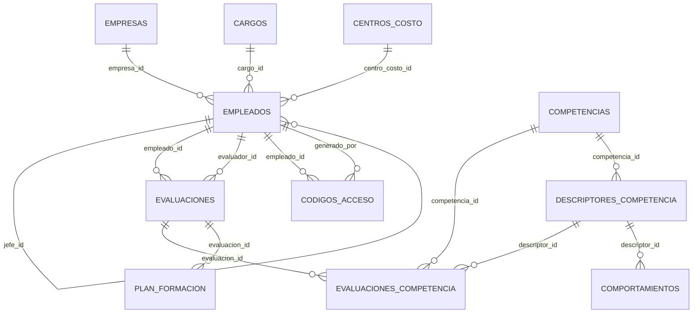

# Diagrama ER - Talentia

## Tablas clave

- EMPLEADOS
- EVALUACIONES
- EVALUACIONES_COMPETENCIA
- COMPETENCIAS
- DESCRIPTORES_COMPETENCIA
- COMPORTAMIENTOS
- PLAN_FORMACION
- CODIGOS_ACCESO
- EMPRESAS
- CARGOS
- CENTROS_COSTO
